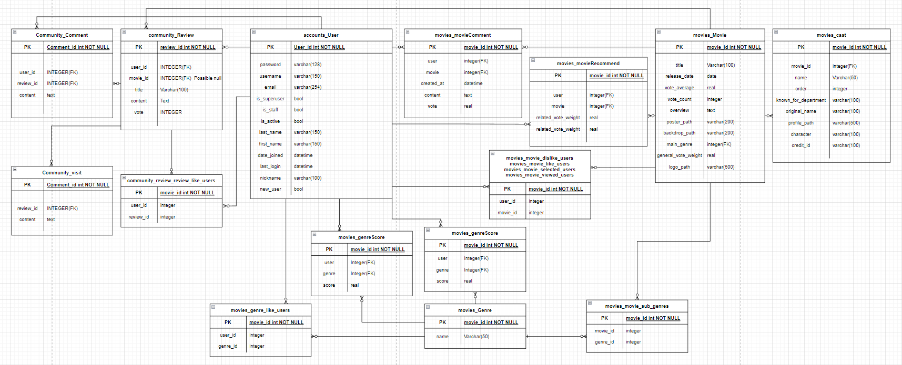
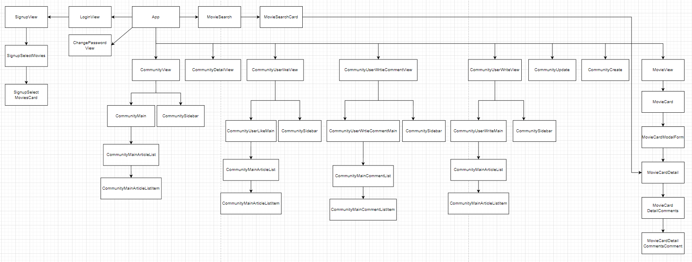

[TOC]

# README

### 1. 프로젝트 구성원

[팀장] 이민지

- 모델링(ERD) - 백엔드 (장고) 전체적인 설계 담당
- TMDB에서 데이터 불러와서 fixture 생성
- django seed를 이용해서 dummy data생성
- 커뮤니티 기능 (ex. 게시글 CRUD, 댓글 CRUD 등등)
- 회원정보 관련 설계
- 보고서 및 PPT 작성

[팀원] 김동주

- User모델 커스텀 및 회원가입, 로그인, 로그아웃
- 영화 추천 알고리즘 구상 및 구현
- 영화 페이지 전반적인 기능(ex. 영화 디테일, 영화 검색 등등)
- 회원정보 관련 구현
- 발표

### 2. 개발환경

Django Rest Framework & Vue

### 3. 프로젝트 요약

- TMDB API를 이용한 영화 정보 제공 & 검색
- 사용자의 데이터를 기반으로 한 영화 추천
- 커뮤니케이션 게시판을 활용한 다른 사용자들과의 커뮤니케이션

### 4. 목표 서비스 구현 및 실제 구현 정도

- 사용자가 좋아하는 장르를 기반으로 한 추천 알고리즘 구현 **[완료]**
- 캐로셀 형식으로 영화 카드 배치 & 모달 형식으로 디테일 페이지 구현 **[완료]**
- 영화 디테일 페이지 내 간단한 평점 및 댓글 기능 **[완료]**
- 영화 검색 **[완료]**
- 계정 관련 기능(회원가입, 로그인, 로그아웃 …) **[완료]**
- 영화를 검색 및 연결해서 평점을 부여할 수 있는 게시글 CRUD **[완료]**
- 게시글 내 댓글 CRUD **[완료]**
- 게시글을 다양한 기준으로 정렬하는 필터 기능 **[완료]**
- 평점을 부여하면 기존 데이터 베이스에 연동이 되도록 하여 추천에 반영 **[완료]**
- optional: 대댓글, 무한스크롤, 해쉬태그, 영화 플레이리스트, 게시글 알림 기능 … [미완]

### 5. 데이터 베이스 모델링(ERD)

### 6. 컴포넌트 구조

### 7. 영화 추천 알고리즘에 대한 기술적 설명

  저희 프로젝트에는 총 5가지의 추천 알고리즘이 존재합니다.
  알고리즘은 다음과 같습니다 :

###### 1) 기본적인 좋아요, 조회수 기반의 영화 추천 시스템 두가지

소제목 그대로 좋아요 수에 따라 표시되는 영화가 정렬됩니다. 또한 별도로 조회수에 따라 표시되는 영화가 정렬되는 추천 시스템이 존재합니다. 조회수 같은 경우, 같은 유저가 한 영화에 대해 중복적으로 조회수를 올리게끔 할 수 없는 구조로 설계되었습니다.

###### 2) 가장 기본적인 토대가 되는 평점 가중치를 이용하는 추천 시스템

해당 영화의 평점을 메긴 유저의 수, 영화들의 평점 수의 상위 일정 퍼센트와 해당 영화의 평점 평균을 이용하여 영화들 간에 근소한 차이를 보이는 가중치 시스템을 구현하여 다른 조건들 (장르나 좋아요 수, 조회수 등...)에 구애받지 않고 TOP20을 추천합니다.

###### 3) 좋아요를 기반으로 한 군집 추천 시스템 ( + 가중치)

영화들에 대해 다음과 같은 평가 시스템 순서를 가집니다.

1. 유저가 좋아요를 누른 영화들을 취합
2. 해당 영화들에 대해 좋아요를 누른 다른 유저들 취합
3. 그 유저들이 좋아요를 누른 다른 영화들을 취합하여 아래와 같이 평가
4. 같은 영화에 대해 좋아요를 누른 유저들이 다수가 됨에 따라 좋아요 개수가 n번 중복되는 영화들이 출현
5. 그 영화들에 대한 좋아요의 개수를 취합하고, 중복되는 좋아요 개수에 따른 어드밴티지 점수를 계산
6. 영화들에 대해 평점과 평점 개수를 기준으로 가중치를 도출하고, 위에서 언급된 어드밴티지 점수 추가
7. 이에 따라 한 군집에서 가장 많이 좋아요를 누른 영화들을 평점 가중치 시스템과 결합하여 추천 영화 목록을 생성

###### 4) 해당 유저의 행동 패턴에 따른 영화 추천 시스템 ( + 가중치)

영화들에 대해 다음과 같은 평가 시스템 순서를 가집니다.
해당 추천 시스템은 장르 요소가 가장 큰 영향을 미칩니다.

- 유저가 회원가입할 때에 추천 시스템을 위해 영화를 선택하게 되고, 이에 따라 각각의 영화에 대한 메인 장르와 서브 장르를 나누어 점수를 차등 분배

- 유저가 좋아요를 누른 영화들의 장르들을 취합하고, 각각의 영화에 대한 메인 장르와 서브 장르를 나누어 점수를 차등 분배

- 유저가 디테일 페이지에 방문한 영화들의 장르들을 취합하고, 각각의 영화에 대한 메인 장르와 서브 장르를 나누어 점수를 차등 분배

- 위 패턴들에 의해 도출된 점수들을 모두 합하여 상위 3개의 장르를 도출

- 상위 3개 장르들의 점수에 따라 어드밴티지 점수를 계산

- 상위 3개 장르의 영화들에 대해 평점과 평점 개수를 기준으로 가중치를 도출하고, 장르에 따른 어드밴티지 점수를 추가

- 이에 따라 장르 점수에 따른 추천과 가중치에 의한 추천이 결합되어 추천 영화 목록을 생성

### 8. 서비스 대표 기능에 대한 설명

- 직관적인 인터페이스: 
  프로젝트를 진행하면서 최대한 직관적이고 심미적으로 아름다운 인터페이스를 만들고자 수많은 고민과 시도를 하였고, 어느정도 유의미한 결과가 나올 수 있었습니다.

- 영화 추천 및 장르에 따른 영화 카테고리 구분: 
  영화 추천 알고리즘들을 통해 유저에게 다각도로 영화들을 추천하게 되고, 추천 시스템이 아니더라도 유저가 원하는 장르의 영화들을 바로바로 찾아볼 수 있도록 장르에 따라 영화들을 분리하여 화면에 표시하게 하였습니다.

- 영화 검색: 
  영화 추천과는 별도로 영화 검색 기능을 넣어서 원하는 영화 정보를 찾아볼 수 있도록 하였습니다. 이때 검색 엔진은 실시간으로 유저의 INPUT에 반응하여 영화 검색 결과를 제공하게 됩니다.

- 영화 디테일 페이지에서 표시하는 정보: 
  영화 디테일 페이지에서는 영화의 줄거리, 장르, 평점, 출연진 등을 제공하게 됩니다.

- 영화 디테일 페이지 내 댓글: 
  영화에 대해서 간단한 댓글을 달고 싶을 때, 커뮤니티 탭으로 이동해서 게시글을 작성하려면 사용자가 불편함을 느낄 수 있기 때문에, 영화 디테일 페이지 내에서도 바로바로 댓글을 작성하고 평점을 부여할 수 있도록 하였습니다. 단 영화 디테일 페이지 내의 댓글을 글자수 제한을 두어서 디테일한 영화 리뷰를 작성하고 싶다면 커뮤니티로 이동해서 게시글을 작성하도록 하여 두 공간의 역할을 구분하였습니다.

- 게시글 필터 기능: 
  게시글을 좋아요, 최신순, 조회수 순으로 다양하게 정렬하여 볼 수 있도록 하였습니다.

- 게시글 영화 연결(영화 해쉬태그): 
  게시글에 영화를 연결할 수 있도록 하여 특정 영화에 대한 리뷰를 작성할 수 있도록 하였고, 또한 영화 연결을 하지 않을 수 있도록 하여 영화와 관련없는 글이나 영화 추천 글 같은 게시글도 작성할 수 있도록 하였습니다.

- 커뮤니티 유저: 
  커뮤니티에서 유저가 활동한 내역을 사이드바에서 게시글을 몇개 썼는지, 댓글을 몇개를 썼는지, 좋아요를 몇개를 썼는지 바로바로 확인하고 해당 내역으로 바로 이동할 수 있도록 하였습니다.

- 평점 기능: 
  커뮤니티의 게시글 & 영화 디테일 페이지 하단의 댓글에서 영화에 대해서 평가를 할 수 있도록 하였고, 해당 평점을 생성, 수정, 삭제할 때마다 기존 TMDB에서 가지고 온 데이터에 반영하여 추천 알고리즘에 반영될 수 있도록 하였습니다.
  
  

### 9. 배운 점 및 느낀 점

- 이민지
  
  이번 final프로젝트는 제가 코딩을 시작하고 처음으로 진행해보는 프로젝트였습니다. 이렇게 프로젝트를 실제로 해보니, 왜 배울 때에는 뭐라도 만들어보라고 하는지 알 것 같았습니다. 실제로 배울 때에는 다 안다고 생각했던 개념들이 막상 프로젝트에서 적용하려고 하니 많이 어려웠습니다. 특히 장고에서 이런 부분을 많이 느꼈습니다. 제가 프로젝트를 시작하고 제일 먼저 한 부부은 DB모델을 설계 및 구현하고, TMDB API에서 데이터를 불러와서 저장하는 일이었습니다. 처음에는 금방 끝날 것이라고 생각했는데, 모델을 설계하는 것부터가 쉽지 않았습니다. 어떤 데이터가 필요할지 정의하고 해당 데이터는 어떤 필드로 만들어야 하고, 다른 데이터들과의 관계는 어떻게 설정해줄 것인지 구조화하는 것이 어려웠던 것 같습니다. 또한 TMDB에서 데이터를 불러오는 일 역시 쉬워보였지만, 제공하는 데이터들을 우리 모델에 맞춰서 정제하고, 가끔씩 비어있는 데이터들과 같이 예외를 처리해주는 것이 필요했습니다. 과거 프로젝트에서는 모델을 어떻게 설계할 것인지 url을 어떻게 사용할 것인지 등을 하나하나 다 알려주었기에 이 과정이 얼마나 어렵고 힘든 과정이었는지 몰랐었는데, 이번 계기를 통해서 처음 알게 된 것 같습니다. 
  
  
  
  이번에 프로젝트를 하면서 다양한 외부 라이브러리들을 사용해보았습니다. 먼저 django-seed를 통해서 더미 데이터를 생성하였고, vue-star-rating을 통해서 별 아이콘을 통한 별점 평가를 구현해보았습니다. 그리고 계정 관련한 라이브러리를 사용해서 로그인, 로그아웃, 회원가입 등을 구현하였습니다. 이렇게 외부 라이브러리를 사용함으로써 스스로 개발하면 오래 걸렸을 기능들을 빠른 시간안에 구현해볼 수 있었습니다. 이를 통해서 수업시간에 익히 들었던 '거인의 어깨 위에서 코딩하라'는 말이 어떤 말인지 많이 와닿았던 것 같습니다. 
  
  
  
  저희 조 같은 경우는 백엔드와 프론트엔드로 역할을 구분하지 않고, 기능별로 역할을 분담하여 진행하였는데, 그래서 하나의 기능을 처음부터 디자인까지 쭉 구현할 수 있었습니다. 그러면서 너무 오래 전에 배워서 기억이 나지 않던 CSS도 다시 해보면서 익히고, JavaScript와 Django 역시 연습해볼 수 있어서 좋았습니다. 
  
  
  
  그리고 이번 프로젝트를 통해서 git 사용법을 익힐 수 있었습니다. 과거에 git은 그냥 github에 데이터를 저장하는 용도로만 사용했었고, 이렇게 다른 사람과 협업을 위해서 사용해본 적은 없었습니다. 수업에서 git을 배우기는 했지만 간단한 실습정도였어서 이것을 협업에서 실제로 하게 되면 어떻게 사용해야 할지 감이 잘안잡혔었는데, 둘 다 같은 master branch에서 작업해서 충돌이 발생해보기도 하고, 데이터를 날려보기도 하면서 git사용법을 체득할 수 있었던 것 같습니다. 추후에 또 협업을 하게 된다면, 잘 사용할 수 있을 것 같습니다. 
  
  
  
  이번 프로젝트를 하면서 아쉬웠거나 후회되는 점을 고르라고 한다면 기획이 조금 부실했던 점을 고르고 싶습니다. 이번 프로젝트에는 주어진 시간이 많이 없었기 때문에 초반에 프로젝트를 설계하는 부분이 부실했고, 프로젝트의 윤곽은 잡고 작업에 들어가긴 했지만 디테일을 잡지 않았기 때문에 작업할 때 결정되고 변경되는 부분들이 꽤 있었습니다. 그에 따라서 당연하게 모델이나 컴포넌트 같은 요소들이 처음 설계했던 것에서 조금씩 조금씩 추가되거나 삭제되었습니다. 그에 따라서 기존에 구현해두었던 기능들을 수정해야 하기도 했습니다. 이런 과정을 거치면서 기획에서 조금 시간을 아끼려고 했던 부분들이 오히려 프로젝트 중에는 시간을 더 많이 뺏어가게 된다는 것을 느꼈습니다. 이를 통해서 다음 프로젝트를 할 때는 기획을 정말 탄탄하게 해야겠다고 생각하였습니다. 지금은 두명이서 하는 프로젝트라서 서로 의사소통도 쉽기 때문에 기획이 조금 부족했어도 잘굴러갔지만, 나중에 많은 사람들이 하는 프로젝트에서는 기획이 부족하면 프로젝트가 산으로 갈 것이기 떄문에, 이번 프로젝트를 통해서 배운 것이 참 다행이라고 생각했습니다.
  
  
  
  코딩을 배우고 나서 처음으로 진행해보는 제대로 된 프로젝트라서, 기대도 많이 되었고 구현해보고 싶은 것들도 많았습니다. 처음 기획할 때 필수와 선택을 나누어서 기능을 계획하였는데, 시간이 부족해서 필수 부분만 구현하고 선택 부분들을 많이 구현을 하지 못하였습니다. 이 부분에 대해서 아쉬움이 남지만 앞으로 프로젝트할 기회가 많기 때문에 그때 더 많은 것들을 해보고 싶습니다. 이번 프로젝트는 시간도 짧고 처음으로 해보는 프로젝트였어서 시행착오가 많았지만 그래도 그만큼 많은 것을 배울 수 있었던 시간이었습니다. 

- 김동주
  
  이번 프로젝트를 진행하면서, 프론트엔드와 백엔드 모두 한층 더 심층적으로 파고들 수 있는 기회가 되었습니다.프로젝트에서 처음으로 진행했던 것이 먼저 UIUX를 구성하는 것이었습니다. 그 과정에서 Vue와 JavaScript를 이용하여 여러 컴포넌트들에 대한 애니메이션을 구현하고, 모달창으로 만들어 즉각적이고 부드러운 UIUX를 만들려고 노력하였습니다. 이 때에 자바스크립트로 의도하는 코드를 작성하였음에도 불구하고 의도하던대로 동작하지 않는 경우가 많았습니다. 예를 들어 모달창을 띄울 때, 버튼이나 사진을 클릭하면 해당 좌표에서 모달창이 작게 생성되어 크기가 커지고 화면의 정 중앙으로 위치를 이동해가는 애니메이션을 구현하고자 하였는데, 여러가지 고려해야할 만한 사항들이 많았습니다.
  
  
  
  대표적으로, CSS의 position:fixed 같은 경우, 부모 요소들에 transform이 적용되어 있을 경우, fixed 요소가 화면에 제대로 고정되지 않고 이리저리 크게 움직이게 되는 경우가 있었습니다. 모달 폼을 구현할 때에, 컴포넌트의 최상위 요소중 하나로 div요소를 fixed position으로 설정하고 width, height, left, top 속성을 조정하여 화면에 딱 맞게, 꽉 차게끔 설정하였습니다. 그리고 그 자식 요소로, fixed 요소에 영향을 받게 되는 absolute position이 적용된 div 요소, 즉 모달창 본체를 만들어 모달 창이 움직이는 좌표가 부모 요소에 영향을 받는 상대 좌표가 아닌 반드시 절대 좌표를 기준으로 움직이게끔 구성하였습니다.
  
  
  
  이러한 과정이 필요했던 이유는 해당 애니메이션이 모달창을 띄우기 위한 버튼의 좌표와 화면의 중앙에 오게끔 하는 좌표를 절대 좌표를 기준으로 이동하게 하여 어떤 컴포넌트에서든, 어떤 상황에서든 사용할 수 있게끔 의도하여 만들기 위함이었기 때문이었습니다. 그런데 위에서 말했듯이 fixed 요소의 특성이 transform 속성에 의해 무효화 됨으로써 모달창이 정상적으로 동작하지 않았습니다. 이러한 비슷한 상황들이 수도 없이 연출되었고, 따라서 이러한 충돌을 알아내고 고치는데 시간이 많이 소요되었습니다. 하지만 수많은 상황들의 원인을 알아내고 적절히 해결한 결과 유의미한 결과를 도출해낼 수 있었습니다. 또한 이러한 과정을 거치면서 Vue와 JavaScript, 그리고 DOM 간의 관계를 어느정도 심층적으로 알 수 있었습니다. 특히 Vue 같은 경우, 컴포넌트 구조로 여러개로 나눠지고 전역 변수를 활용할 수 있는 등, 프론트엔드 프레임워크에 대한 특장점과 특성을 어떻게 더 잘 활용할 수 있을 지에 대한 감을 잡을 수 있는 좋은 기회가 되었습니다.
  
  
  
  다음으로, 회원 정보에 관련된 여러 프론트엔드, 백엔드 이슈들입니다. 회원 정보를 다루면서, 프레임워크의 공통된 특성을 좀 더 와닿게 알 수 있었습니다. 그것은 바로 배워야 한다는 것입니다. 기본적인 프로그래밍 언어를 배우면 이를 활용해 여기저기서 응용하여 사용할 수도 있지만, 프레임워크는 배운만큼 써먹을 수 있다는 것을 느낀 것이 바로 회원 정보를 관리하는 기능을 만들면서 부터였습니다. 회원가입할 때에 유효성 검사에 대한 데이터는 어디서 받고, axios로 요청을 보냈을 때 그 요청이 특정 원인에 의해 거부되었을 때 프론트에서 어떻게 표시할 지에 대한 것도 난제였습니다. 그러한 모든 것들을 Django document를 이용 하던, 구글링을 하던 해서 배웠어야 했지만 해당 이슈에 대한 정보의 부제로 결국은 약간은 정석적이지 않게 유효성 검사를 Vue 내에서 자체적으로 처리하게끔 구성하게 되었고, axios 요청이 실패 했을때에 대한 메시지를 세분화하지 못하였습니다.
  
  
  
  마지막으로 추천 알고리즘의 경우, 본격적으로 시작하기 전까지는 막막했었지만 막상 시작하고 나니 흥미를 느낄 수 있었습니다. Django의 경우, Vue에 비해 상대적으로 배운 기간이 좀 더 오래 되서 많이 깜빡한 부분도 있었지만, 알고리즘 구성에 대해 페어인 민지의 도움을 많이 받아가며 결국엔 알고리즘 구성을 잘 할 수 있었던 것 같습니다. 추천 알고리즘의 경우, 코드를 구성해 나가면서 느꼈던 것이 단순 알고리즘 하나보다는 여러가지를 결합해 나가는 것이 좋다는 것이었습니다. 가중치의 경우, 다른 요소들을 일체 배제하고 사용하게 되면 특정 장르나 감독 등에 대해 편향적인 특성을 보이게 되었고, 결국 대다수를 모두 만족시키기에는 한계가 있어 보였습니다. 그래서 가중치를 가미한 장르 점수기반 추천 알고리즘, 가중치를 가미한 군집 패턴 영화 추천 알고리즘을 구성하였고, 케이스는 얼마 되지 않지만 직접 추천 알고리즘에 대한 데이터를 누적하고 어떤 영화를 추천하는지를 모니터링 해 보니 어느정도 유효한 추천을 한다는 것을 알게 되었습니다. 또한, 이러한 추천 알고리즘을 구현하면서 DB와 알고리즘의 관계를 잘 생각해보게 되었는데, 맨땅에서 해당 추천 알고리즘을 구현하라고 한다면 어려움이 매우 컸을 것인데, DB를 이용하여 Primary Key를 이용한 ForeignKey, ManyToManyField 기능들이 알고리즘과 결합되면서 매우 큰 시너지를 낼 수 있었습니다. 그런 점으로 보아 DB를 관리하는 백엔드에 대한 중요성이 크다는 것을 알게 되었고 또 체감하게 되었습니다.
  
  
  
  이번이 첫 프로젝트라 여러 우여곡절이 많았지만 그래도 계획된 시간 내에 어느정도 계획했던 대로 대부분 끝낼 수 있어서 만족스러웠습니다. 하지만 여러 아쉬운 점들도 있는 바, 다음 프로젝트 때에는 백엔드던 프론트엔드던 좀 더 효율적이고 깔끔하게 코드와 구조를 구성하고 유지할 수 있을 것 같은 느낌이 들었습니다.